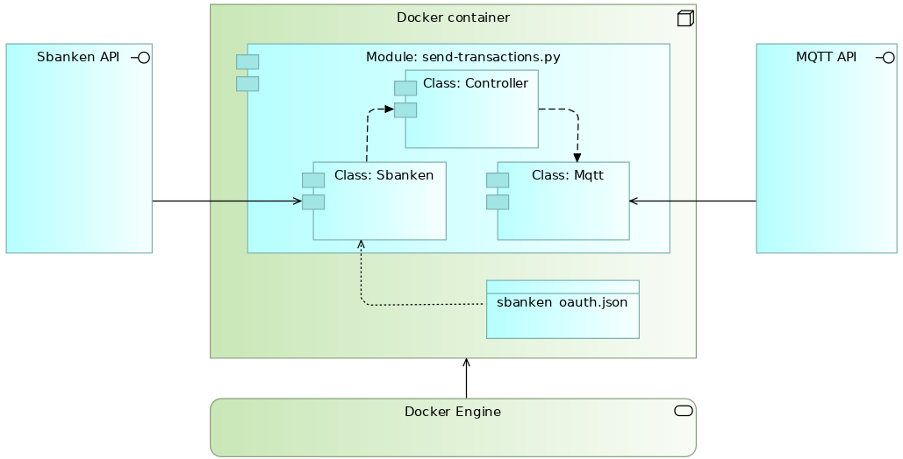
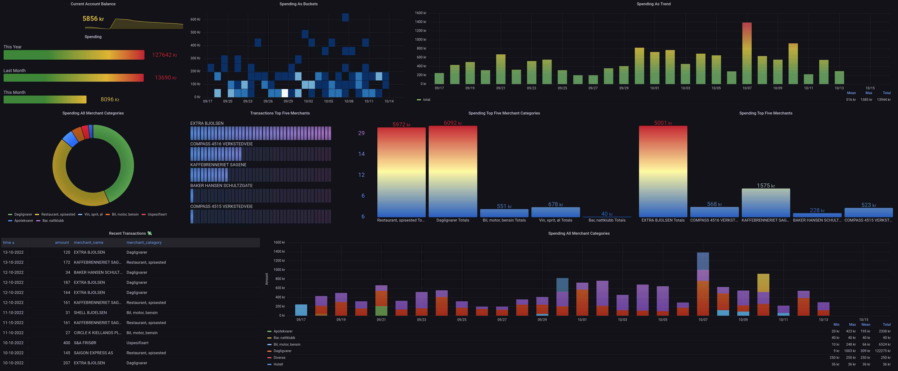

# About
The Python code in this folder uses Sbanken's archived transcations API to retrieve recently archived transactions for a specified account. Once the data is received, the code modifies the data structure and publishes the data to a MQTT topic.

**There are a few things that must be in place for this code to work:**
- You must have access to Sbanken's archived transactions API. Sbanken has a [developer portal](https://sbanken.no/bruke/utviklerportalen/) that provides all the necessary instructions to get started.
- Although it will work to run the script manually, its best to run it either through [systemd](https://en.wikipedia.org/wiki/Systemd) or Docker. This will ensure that the script runs continously and you will also get some built-in error handling, e.g. automatic restart if something unexpected happens. The code in this folder assumes Docker engine is running.
- The script publishes message to a [MQTT](https://mqtt.org/) topic. MQTT is freely available and can for example be run as a [Docker container](https://hub.docker.com/_/eclipse-mosquitto). 

>*I made this code to hone my Python skills and to experiment with Sbanken's API. As such there may be flaws and choices in the code that could represent issues with information security. Sbankens API accesses production data, i.e. actual data/money, so keep this in mind if you would like to use this code*

**About the files in this folder**
- `create-container-finance.sh`
Send commands to the Docker engine to create image and container and to run the container
- `send-finance.Dockerfile`
Instructions to the Docker engine on how to build the image
- `requirements.txt`
Information about Python packages to be included in the image
- `sbanken_oauth.json`
Customer specific information needed to access Sbanken's APIs
- `send_transactions.py`
The actual script that will be run in the container

**Overview of the main components**

**Complete the following steps to get the code running**
1. Copy the files in this folder to your environment. Best would be to clone it with Git, so you receive updates when the code is improved
2. Login to Sbankes developer portal and retrieve client id, client secret, customer id and account id. Note that account id is not the same as account number. You may need to query Sbankens customer API to get the account id. Enter this information into the file `sbanken_oauth.json`. Make sure no one else has access to this file.
3. Modify the shell script `create-container-finance.sh` according to suit your environment, e.g. with information about the MQTT broker.
4. Run the shell script `create-container-finance.sh`.

The script only sends data to the MQTT topic. Only creativity limits what is possible to do with that data. For me, I am interested in figuring out why my money somehow seem to disappear in thin air. As such I have created another piece of code that subscribes to the topic, writes the data to MariaDB and visualises it in Grafana. Information about that code will follow later.
