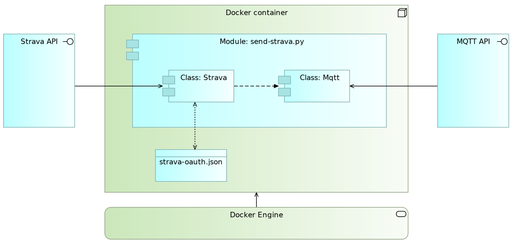

# About
The Python code in this folder use Strava's activities API. The main purpose is to retrieve personal activity and store it locally in order to do analysis and visualistion beyond what is offered by Strava. Second, the code also makes it possibly to automatically update activities meeting certain criteria. This can be useful if you for instance want consistent naming of commuting activities.

# Info about executables and parameter files in this folder
- `send_strava.py`
Uses Strava activities API to retrieve rides for a specified athlete for the last three days. Once the data is received, the module modifies the data structure and publishes the data to a MQTT topic. Contains loops so it runs repeatedly, e.g. in a container or through systemd
- `send_strava_manual.py`
Same as `send_strava.py`, execpt that it accepts a date range as input and runs only once
- `update_strava.py`
Uses Strava activities API to update recent activities based on user defined criteria
- `oauth_helper.py`
Uses Strava oauth endpoint to retrieve initial access tokens
- `create-container-send-strava.sh`
Sends commands to the Docker engine to create image and container and to run the container with the `send_strava.py` module
- `create-container-update-strava.sh`
Sends commands to the Docker engine to create image and container and to run the container with the `update_strava.py` module
- `send-strava-requirements.txt`
Information about Python packages to be included in the docker image for the `send_strava.py` module
- `update-strava-requirements.txt`
Information about Python packages to be included in the docker image for the `update_strava.py` module
- `strava_tokens.json`
User specific information needed to authorize with Strava's APIs
- `strava_gear.json`
User specific information needed to update gear in a given ride
- `send-strava.Dockerfile`
Instructions to the docker daemon for building image for the `send_strava.py` module
- `update-strava.Dockerfile`
Instructions to the docker daemon for building image for the `update_strava.py` module

# Configuration instructions
You must have access to Strava's activities API for these modules to work. Strava has a [developer portal](https://developers.strava.com/) that provides all the necessary instructions to get started. Please note that except `oauth_helper.py` and `send_strava_manual.py`, which are written to be run ad-hoc, its best to run the modules either through [systemd](https://en.wikipedia.org/wiki/Systemd) or Docker. This will ensure that the scripts runs continously and you will also get some built-in error handling, e.g. automatic restart if something unexpected happens. The code in this folder assumes Docker engine is running. . 

>*I made this code to hone my Python skills and to experiment with Strava's API. As such there may be flaws and choices in the code that could represent issues with information security. Strava API accesses real data, i.e. actual activity data, so keep this in mind if you would like to use this code*

## Prerequisites for all modules
1. Copy the files in this folder to your environment. Best would be to clone it with Git, so you receive updates when the code is improved
2. Obviously you will need to be a registered user with Strava for this code to work. But you also need to obtain som extra credentials from Strava to get the oauth2 process going. This basically means that you need to [complete a form](https://strava.com/settings/api) available at Strava's developer portal and then use the info from that step to retrieve oauth tokens. Tekk Sparrow Program has made an excellent [Youtube-tutorial](https://www.youtube.com/watch?v=MrODoLLkM5E) on how to do this and even [provided a script]()https://github.com/tekksparrow-programs/simple-api-strava/blob/main/simple-api-strava.py. You can also use the `oauth2_helper.py` script in this folder, which is directly based on the one written by Tekk Sparrow Programs.
3. Modify `strava_tokens.json` with the info returned from the script you ran in the previous step. This is a one time process. Once this is done, the modules in this folder will use refresh tokens to automatically update your access token when it expires.

Strava requires authentication with OAuth2. It looks complicated, but is fairly straight forward to configure if you follow [Stravas step-by-step guide](https://developers.strava.com/docs/getting-started/#oauth). In the script we are using here, the tokens are handled through a json file, which must look as following.

## Configuration of send_strava.py and send_strava_manual.py

`send_strava.py` publishes message to a [MQTT](https://mqtt.org/) topic. MQTT is freely available and can for example be run as a [Docker container](https://hub.docker.com/_/eclipse-mosquitto)

3. Modify the shell script `create-container-finance.sh` according to suit your environment, e.g. with information about the MQTT broker.
4. Run the shell script `create-container-finance.sh`.

Create the container that retrieves data from Strava with the command below. This container only retrieves data from Strava and sends it to the mqtt broker. It does not need to persist data. The commands must be run from the directory that contains `Dockerfile` and `requirements.txt`. The script here is quite rudimentary in regards to the handling of data. Benji Knights Johnson has a better approach, using Pandas, that is described [in an article on medium](https://medium.com/swlh/using-python-to-connect-to-stravas-api-and-analyse-your-activities-dummies-guide-5f49727aac86).

The script only sends data to the MQTT topic. Only creativity limits what is possible to do with that data. For me, I am interested in figuring out why my money somehow seem to disappear in thin air. As such I have created another piece of code that subscribes to the topic, writes the data to MariaDB and visualises it in Grafana. Information about that code will follow later.

## Configuration of update_strava.py